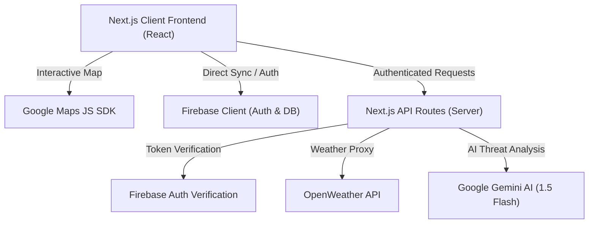

# CrowdCommand 🏟️

### Stadium Crowd Management & Emergency Command Center

CrowdCommand is a professional, full-stack stadium security and real-time operations dashboard built using Next.js 14, Google Maps, Firebase, and Google Gemini AI. It provides stadium organizers, safety officers, and emergency responders with a complete command center to monitor gate flow, track VIP movement, coordinate alerts, and generate automated AI threat analyses.

---

## 🏗️ Architecture Flow



---

## 🚀 Key Features

*   **Real-time Gates Telemetry**: Monitored view of all 8 stadium entry gates with simulated wait times, gate status (Clear, Busy, Critical), and aggregate capacity meters.
*   **Live Crowd Heatmap**: Integrated dark-themed Google Maps interface plotting coordinate-based crowd density around the stadium.
*   **Interactive Gate Commands**: Override entry flows in real-time by Locking gates or Redirecting traffic to adjacent entrances.
*   **VIP Escort Tracking**: Real-time status tracker (Escort Active, En Route, On Standby) across 4 high-profile VIP zones.
*   **AI Threat & Incident Analyst**: Instantly report stadium incidents (medical emergencies, brawls, infrastructure failures) and receive instant, structured response cards and mitigation steps generated by Google Gemini AI.
*   **Emergency Evacuation Protocol**: Activating Evacuation Mode sets all entrances to exit-only (indicated in red) and broadcasts immediate, system-wide emergency alerts.
*   **Advanced Backend Security**: Fully hardened API layer verifying client-side Firebase ID tokens on all dynamic endpoints via the secure Firebase REST API.

---

## 🏟️ Generalizing for Any Stadium

While the platform is pre-configured out-of-the-box with coordinates, gate layouts, and telemetry details for the **Narendra Modi Stadium (Ahmedabad, India)**, its architecture is **fully generalizable** to support any stadium or large-scale event venue worldwide. 

To adapt this platform for a new stadium, only three lightweight modification points are required:

1. **Map Rendering Coordinates ([`components/MapWidget.jsx`](file:///d:/Codebase/APL_BLR_1/stadium-command/components/MapWidget.jsx))**:
   Update `STADIUM_CENTER` to the latitude/longitude of your chosen stadium:
   ```javascript
   const STADIUM_CENTER = { lat: YOUR_LAT, lng: YOUR_LNG };
   ```
2. **Gate Telemetry Layout ([`lib/mockData.js`](file:///d:/Codebase/APL_BLR_1/stadium-command/lib/mockData.js))**:
   Update the `STADIUM_CENTER` coordinates and define the GPS positions for each gate inside the `GATES` array to locate markers accurately.
3. **Sidebar Details & Capacity ([`components/Sidebar.jsx`](file:///d:/Codebase/APL_BLR_1/stadium-command/components/Sidebar.jsx))**:
   Modify the hardcoded venue card values (Venue name, city/state, and capacity) at the bottom of the sidebar.

---

## 🛠️ Technology Stack

*   **Framework**: Next.js 14 (App Router, Standalone Build Output)
*   **Styling**: Modern dark-themed CSS system (Harmonious HSL palettes, glassmorphism, responsive grid layouts)
*   **Real-time DB & Auth**: Firebase Authentication & Realtime Database
*   **AI Insights**: Google Gemini AI (`gemini-1.5-flash` with graceful mocked API fallbacks)
*   **Maps & Geospatial**: Google Maps JS API (V2 Loader, Heatmap Visualization Layer)
*   **CI/CD & DevOps**: GitHub Actions, Google Cloud Run, Google Artifact Registry, GCP Secret Manager

---

## 💻 Local Development Setup

Follow these steps to set up and run the CrowdCommand platform locally on your machine.

### 📋 Prerequisites
*   **Node.js**: Version 20.x or higher
*   **npm**: Version 10.x or higher
*   **PowerShell** (optional, for running the integration test suite on Windows)

### 📥 Step 1: Install Dependencies
Clone the repository and install the project dependencies:
```bash
npm install
```

### 🔑 Step 2: Configure Environment Variables
Create a local environment file by copying the template:
```bash
cp .env.example .env.local
```

Open `.env.local` and populate the required API keys and configuration values:

| Variable | Source / Description |
| :--- | :--- |
| `NEXT_PUBLIC_GOOGLE_MAPS_API_KEY` | Google Cloud Console (Maps JavaScript & Heatmap APIs enabled) |
| `OPENWEATHER_API_KEY` | OpenWeatherMap API credentials |
| `GEMINI_API_KEY` | Google AI Studio Developer Key |
| `NEXT_PUBLIC_FIREBASE_API_KEY` | Firebase Project Web App config |
| `NEXT_PUBLIC_FIREBASE_AUTH_DOMAIN` | Firebase Project Web App config |
| `NEXT_PUBLIC_FIREBASE_DATABASE_URL` | Firebase Realtime Database URL |
| `NEXT_PUBLIC_FIREBASE_PROJECT_ID` | Firebase Project ID |
| `NEXT_PUBLIC_FIREBASE_STORAGE_BUCKET` | Firebase Project Web App config |
| `NEXT_PUBLIC_FIREBASE_MESSAGING_SENDER_ID`| Firebase Project Web App config |
| `NEXT_PUBLIC_FIREBASE_APP_ID` | Firebase Project Web App config |
| `FIREBASE_SERVICE_ACCOUNT_KEY` | Firebase Admin Service Account JSON key (for secure token verification) |

### 🚀 Step 3: Run the Development Server
Start the Next.js development server:
```bash
npm run dev
```
Open your browser and navigate to [http://localhost:3000](http://localhost:3000) to see the interactive command center live.

---

## 🧪 E2E Automated Integration & Security Testing

The application includes a rigorous, emoji-free PowerShell test suite that validates the security barriers of all server-side API endpoints, checking that credentials are safe and telemetry is correctly formatted.

Run the test suite with:
```powershell
powershell -ExecutionPolicy Bypass -File test-all.ps1
```

### Coverage
1.  **GET `/api/crowd-data`**: Blocks unauthorized requests (`401`), returns correct gate telemetry schema when authorized (`200`).
2.  **GET `/api/weather`**: Blocks unauthorized requests (`401`), returns weather metadata proxy when authorized (`200`).
3.  **POST `/api/ai-analysis`**: Blocks unauthorized requests (`401`), returns Gemini threat analysis payload when authorized (`200`).
4.  **POST `/api/alerts`**: Blocks unauthorized requests (`401`), logs and broadcasts active alert payloads when authorized (`201`).

To validate all local and secret keys, run the verification script:
```powershell
powershell -ExecutionPolicy Bypass -File validate.ps1
```

---

## ⚙️ CI/CD Deployment Architecture

The repository contains a fully automated DevOps pipeline configured at `.github/workflows/deploy.yml`:

### 🔗 CI/CD Pipeline Flow
1.  **Verification**: Automatically runs ESLint checks to guarantee code sanity.
2.  **Docker Containerization**: Uses a highly optimized multi-stage `Dockerfile` capturing lightweight assets. Client-side variables (`NEXT_PUBLIC_*`) are securely passed as build arguments.
3.  **Artifact Registry**: Automatically builds and pushes the container to Google Artifact Registry.
4.  **Cloud Run Deployment**: Deploys to Google Cloud Run, mounting sensitive server-only credentials (`GEMINI_API_KEY`, `OPENWEATHER_API_KEY`) safely from Google Secret Manager.

### 🛡️ IAM Permissions Configuration
To ensure seamless deployment and runtime execution, verify the following IAM roles are granted:

*   **Deployer Identity** (used by GitHub Actions):
    *   Needs the `Cloud Run Admin` role, `Artifact Registry Writer` role, and `Service Account User` role on the deployer service account (e.g., `github-deployer@apl-ggn-1.iam.gserviceaccount.com`).
*   **Runtime Identity** (used by Cloud Run to access Secret Manager):
    *   The **Default Compute Engine Service Account** (e.g., `1026717545869-compute@developer.gserviceaccount.com`) must have the **Secret Manager Secret Accessor** (`roles/secretmanager.secretAccessor`) role granted at the project level or for the specific secrets.
    ```bash
    gcloud projects add-iam-policy-binding YOUR_PROJECT_ID \
        --member="serviceAccount:YOUR_PROJECT_NUMBER-compute@developer.gserviceaccount.com" \
        --role="roles/secretmanager.secretAccessor"
    ```
